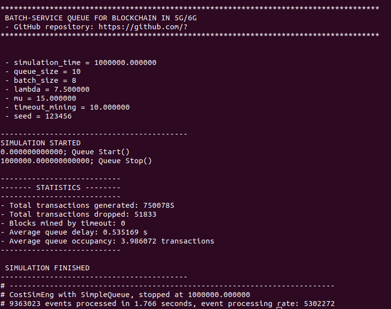

# README #

This repository contains a batch service queue simulator written in C/C++, which has been used to validate the blockchain delay model proposed in Wilhelmi, F., & Giupponi, L. (2021). Discrete-Time Analysis of Wireless Blockchain Networks. arXiv preprint arXiv:2104.05586.

### Authors ###

* Lorenza Giupponi (lorenza.giupponi@cttc.es)
* Francesc Wilhelmi (fwilhelmi@cttc.cat)

### How to use? ###

1) Set permissions to the folder where the repository is allocated:

```
$ chmod -R 777 <dirname>
```

2) Build the project in the "main" folder

```
$ ./build_local
```

3) Run the queue simulator

```
$ ./queue_main -simulation_time -logs_enabled -queue_size -batch_size -lambda -mu -timeout_mining -seed
```

The input parameters are described next:

* ```simulation_time```: total simulation time

* ```logs_enabled```: flag to enable logs (discouraged for large simulations)

* ```queue_size```: size of the queue in number of packets

* ```batch_size```: size of the batch whereby packets are served together

* ```lambda```: system arrivals in transactions per second

* ```mu```: service rate at which the queue processes batches

* ```timeout_mining```: timeout that forces a batch to be served, even if it is not full

* ```seed```: random seed

Optionally, the user can simulate the effect of forks by including extra input parameters:

```
$ ./queue_main -simulation_time -logs_enabled -queue_size -batch_size -lambda -mu -timeout_mining -n_miners -capacity_p2p -seed
```

The additional parameters are described next:

* ```n_miners```: total number of miners participating in the consensus protocol

* ```capacity_p2p```: capacity of the P2P links in bits per second

4) Simulation example

```
$ ./queue_main 1000000 0 10 8 7.5 15 10 123456
```

Output:



### Want to contribute? ###

If you want to contribute, please contact to fwilhelmi@cttc.cat
